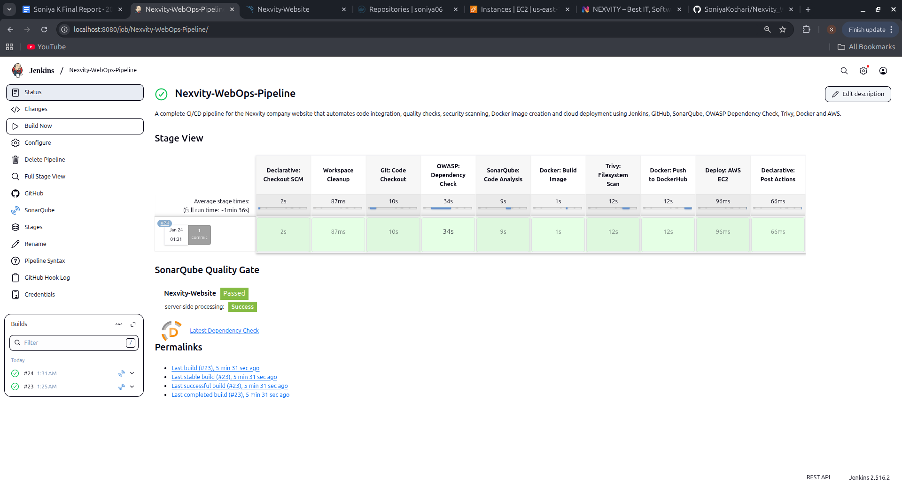
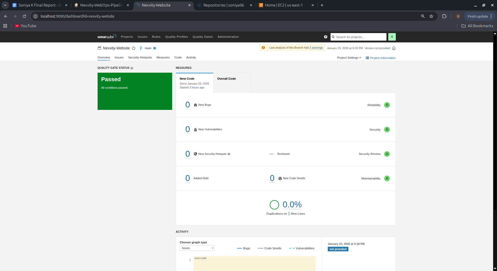
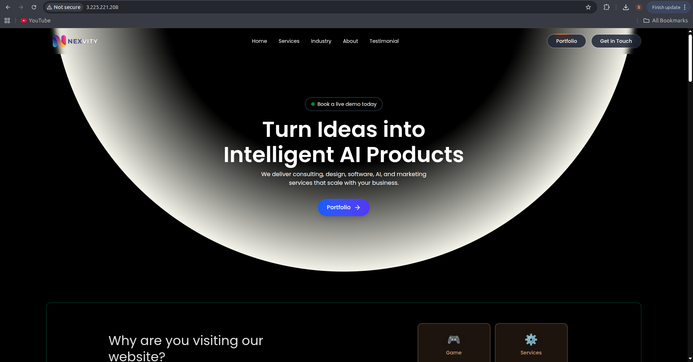

# 🚀 Automated Testing & Deployment Workflow

This project demonstrates a complete **DevOps CI/CD pipeline** that automates the process of building, testing, securing, containerizing, and deploying a web application to the cloud.

The main goal is to eliminate manual steps and ensure every code change goes through a standardized, reliable pipeline before deployment.

---

## 📌 Project Overview

The workflow starts when a developer pushes code to GitHub. From there, the pipeline automatically:

- Builds the application
- Performs code quality checks
- Runs security scans
- Creates a Docker image
- Scans the container for vulnerabilities
- Pushes the image to Docker Hub
- Deploys the application to AWS

This ensures **consistent, secure, and automated delivery** of applications.

---

## ⚙️ Tech Stack

- **Version Control:** Git, GitHub  
- **CI/CD Tool:** Jenkins  
- **Code Quality:** SonarQube  
- **Security Tools:** OWASP Dependency Check, Trivy  
- **Containerization:** Docker  
- **Registry:** Docker Hub  
- **Cloud Platform:** AWS EC2  
- **OS:** Ubuntu Linux  

---

## 🔄 Workflow Pipeline

1. **Code Push (GitHub)**
   - Developer pushes code to repository
   - Webhook triggers Jenkins pipeline

2. **Build Stage**
   - Application is built and validated

3. **Code Quality Check**
   - SonarQube analyzes:
     - Bugs
     - Code smells
     - Maintainability

4. **Dependency Security Scan**
   - OWASP Dependency Check scans libraries for vulnerabilities

5. **Docker Build**
   - Application is containerized into a Docker image

6. **Image Security Scan**
   - Trivy scans Docker image for vulnerabilities

7. **Push to Docker Hub**
   - Secure image is versioned and stored

8. **Deployment (AWS)**
   - EC2: Runs containerized application  

---

## 🧠 Key Features

- Fully automated CI/CD pipeline
- Integrated code quality checks
- Multi-level security scanning
- Containerized deployment
- Cloud-based hosting
- Fail-fast mechanism (pipeline stops on errors)

---

## 🖥️ System Requirements

### Hardware
- Processor: Intel i3 or above  
- RAM: 4 GB (8 GB recommended)  
- Storage: 120 GB SSD  
- Internet: High-speed connection  

### Software
- Ubuntu Linux  
- Git & GitHub  
- Jenkins  
- Docker  
- SonarQube  
- OWASP Dependency Check  
- Trivy  
- AWS Account  

---

## 🧪 Testing Strategy

The project follows **Continuous Integration and Continuous Deployment (CI/CD)** practices:

- Automated testing at every stage
- Pipeline stops if any step fails
- Ensures:
  - Code quality
  - Security compliance
  - Deployment reliability

---

## 📊 Architecture

The system includes:

- Flowchart of pipeline
- Data Flow Diagrams (Level 0, 1, 2)
- Use Case Diagram
- Sequence Diagram
- Activity Diagram
- Class Diagram

---

## 📚 Learning Outcomes

- Practical understanding of DevOps (CI/CD)
- Hands-on experience with industry tools
- Improved debugging and troubleshooting skills
- Understanding of cloud deployment
- Experience with automation workflows

---

## 📸 Screenshots

### 🔹 Jenkins Pipeline (CI/CD Execution)

### 🔹 SonarQube Code Quality Report

### 🔹 Deployed Application (AWS EC2)

---

## 👩‍💻 Author

**Soniya Kothari**
